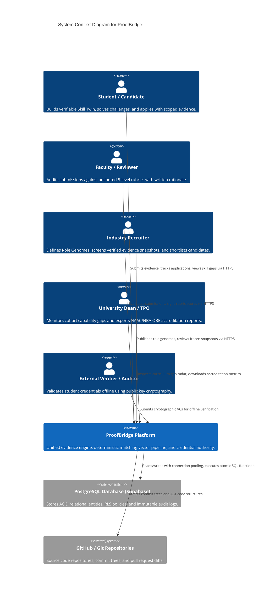
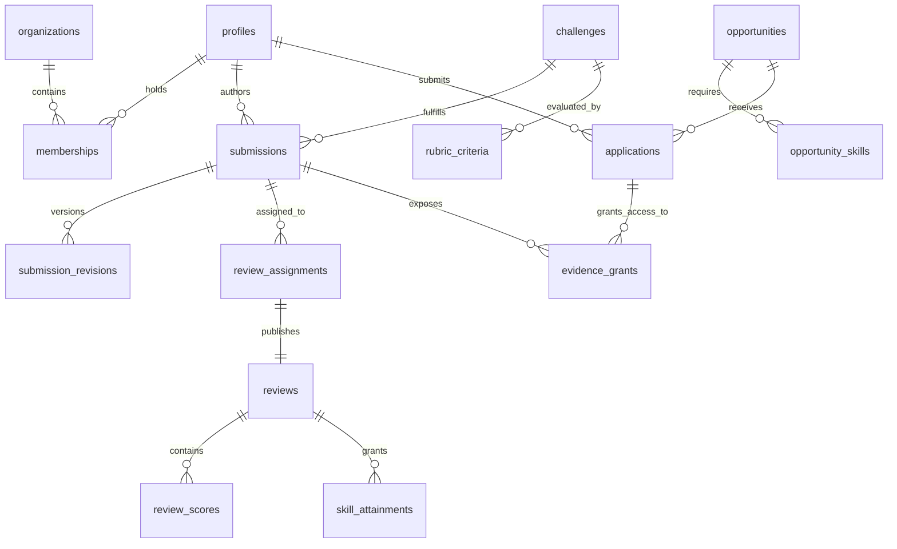

# ProofBridge — System Architecture & Technical Specifications

> **Version:** 1.0 • **Target Runtime:** Next.js 14+ (App Router), PostgreSQL 15+, TypeScript 5.5  
> **Status:** Production / Hackathon Core Release

---

## 1. Architectural Philosophy & Design Principles

ProofBridge is engineered to solve the systemic failure of self-reported resumes and credential inflation in technical hiring. The platform is designed around four non-negotiable architectural tenets:

1. **Evidence Over Assertion:** A competency cannot exist within a candidate profile without traceable, audited evidence (Git AST code inspection, reproducible queries, or accredited faculty rubric assessments).
2. **Deterministic & Explainable Matching:** Algorithmic ranking does not rely on opaque LLM embeddings or probabilistic scores that hallucinate. All matchmaking is mathematically deterministic via the `coverage-v1` algorithm, yielding a transparent, auditable breakdown.
3. **Defense-in-Depth Multi-Tenancy:** Strict tenant isolation is enforced at the database layer using PostgreSQL Row Level Security (RLS) and parameterized `SECURITY DEFINER` procedures. Competitors or unauthorized institutions can never traverse tenant boundaries.
4. **Offline Zero-Gas Cryptographic Verifiability:** Attainments are signed and structured as W3C Verifiable Credentials (VCs). Third-party employers can cryptographically verify credentials offline via public key cryptography without paying gas fees or querying a central proprietary database.

---

## 2. C4 Architecture Models

### 2.1 Level 1: System Context Diagram



---

### 2.2 Level 2: Container Diagram (System Topology)

```mermaid
graph TD
    subgraph Client Layer
        WebBrowser["Modern Web Browser<br/>(React 18 / Next.js SPA Client)"]
        MobilePWA["Mobile Browser / PWA<br/>(Tailwind Responsive UI)"]
    end

    subgraph ProofBridge Application Server (Edge / Node.js Runtime)
        NextRouter["Next.js App Router<br/>(Server Components & SSR)"]
        APIRouteHandlers["REST API Endpoints<br/>(/api/v1/*)"]
        AuthMiddleware["Authentication & Persona Guard<br/>(Supabase JWT & Persona Context)"]
        MatchingEngine["Deterministic Matcher<br/>(Coverage-v1 Vector Math)"]
        SnapshotSerializer["Snapshot Freezer<br/>(W3C VC JSON-LD Generator)"]
        VerifierEngine["Cryptographic Verifier<br/>(SHA-256 Merkle Proof Engine)"]
    end

    subgraph Data & Persistence Layer
        PgBouncer["Connection Pooler<br/>(PgBouncer / Transaction Mode)"]
        PostgresInstance["PostgreSQL 15 Database<br/>(Row Level Security & Functions)"]
        AuditLedger["Immutable Audit Log<br/>(Append-Only Ledger)"]
        OutboxQueue["Outbox Event Pipeline<br/>(Event Dispatcher)"]
    end

    WebBrowser -->|HTTPS / WSS| NextRouter
    MobilePWA -->|HTTPS| NextRouter
    NextRouter --> APIRouteHandlers
    APIRouteHandlers --> AuthMiddleware
    AuthMiddleware --> MatchingEngine
    AuthMiddleware --> SnapshotSerializer
    AuthMiddleware --> VerifierEngine

    APIRouteHandlers -->|Native pg Pool| PgBouncer
    PgBouncer --> PostgresInstance
    PostgresInstance --> AuditLedger
    PostgresInstance --> OutboxQueue
```

---

## 3. Data Architecture & Relational Entity Map

The database architecture comprises 24 relational tables grouped into six functional subsystems:

```
┌─────────────────────────────────────────────────────────────────────────────┐
│                             CORE ENTITY DOMAINS                            │
├──────────────────────┬──────────────────────┬───────────────────────────────┤
│ 1. Identity & Tenant │ 2. Skills & Roles    │ 3. Submissions & Challenges   │
│ - profiles           │ - skills             │ - challenges                  │
│ - organizations      │ - skill_levels       │ - submissions                 │
│ - memberships        │ - opportunities      │ - submission_revisions        │
│ - auth_identities    │ - opportunity_skills │ - reference_links             │
├──────────────────────┼──────────────────────┼───────────────────────────────┤
│ 4. Evaluation Engine │ 5. Application Engine│ 6. Cryptography & Audit       │
│ - rubric_criteria    │ - applications       │ - verifiable_credentials      │
│ - review_assignments │ - application_stages │ - evidence_grants             │
│ - reviews            │ - application_audits │ - audit_events                │
│ - review_scores      │ - snapshot_payloads  │ - outbox_events               │
│ - skill_attainments  │                      │ - idempotency_records         │
└──────────────────────┴──────────────────────┴───────────────────────────────┘
```

### Key Relational Foreign Key Graph:


---

## 4. The Deterministic Matching Engine (`coverage-v1`)

Unlike heuristic keyword searches or generative AI embeddings that hallucinate candidate qualifications, ProofBridge computes match suitability through a mathematically deterministic capability vector:

### Formula:
$$\text{Coverage Score } (S) = \left( \sum_{i=1}^{n} w_i \cdot \min\left(1, \frac{v_i}{r_i}\right) \right) \times \prod_{m \in \text{Mandatory}} \delta_m$$

Where:
* $n$: Number of distinct competency requirements for the opportunity.
* $w_i$: Normalized weight assigned to skill $i$, such that $\sum_{i=1}^{n} w_i = 1.0$.
* $v_i \in \{0, 1, 2, 3, 4\}$: Verified candidate attainment level, signed by an authorized faculty reviewer.
* $r_i \in \{1, 2, 3, 4\}$: Role requirement level stipulated by the hiring partner.
* $\delta_m \in \{0, 1\}$: Binary mandatory gate indicator. If a candidate fails a mandatory requirement ($v_m < r_m$), $\delta_m = 0$, dropping overall coverage to zero.

### Worked Example: The 61% to 96% Match Leap

| Competency | Weight ($w_i$) | Required ($r_i$) | Initial Level ($v_i$) | Initial Score | Post-Challenge Level | Post-Challenge Score |
|---|---|---|---|---|---|---|
| **SQL & Relational Modeling** | 35% (0.35) | Level 3 | Level 0 | $0.35 \times \frac{0}{3} = 0.00$ | Level 3 | $0.35 \times \frac{3}{3} = 0.35$ |
| **Spreadsheets & Modeling** | 25% (0.25) | Level 3 | Level 3 | $0.25 \times \frac{3}{3} = 0.25$ | Level 3 | $0.25 \times \frac{3}{3} = 0.25$ |
| **Technical Communication** | 16% (0.16) | Level 4 | Level 3 | $0.16 \times \frac{3}{4} = 0.12$ | Level 3 | $0.16 \times \frac{3}{4} = 0.12$ |
| **Analytical Reasoning** | 24% (0.24) | Level 3 | Level 3 | $0.24 \times \frac{3}{3} = 0.24$ | Level 3 | $0.24 \times \frac{3}{3} = 0.24$ |
| **Total Coverage** | **100%** | — | — | **61.0%** | — | **96.0%** |

```
Initial Fit:  [██████████████░░░░░░░░░] 61.0%
Missing Competency Identified: SQL & Relational Querying (-35.0%)
Action: Student Solves Challenge #402 ("Explain Monthly Sales Anomalies")
Faculty Review Published: Level 3 Achieved
Post-Audit Fit: [███████████████████░░] 96.0% (+35.0% Leap)
```

---

## 5. Cryptographic Proof & W3C Verifiable Credentials

ProofBridge implements the **W3C Verifiable Credentials Data Model 1.1** with **Decentralized Identifiers (DIDs)**.

```json
{
  "@context": [
    "https://www.w3.org/2018/credentials/v1",
    "https://schema.proofbridge.dev/credentials/v1"
  ],
  "id": "urn:uuid:8b3fa760-496a-4d76-904d-2e865fbb6720",
  "type": ["VerifiableCredential", "ProofBridgeSkillAttainment"],
  "issuer": {
    "id": "did:proofbridge:org:manipal-jaipur",
    "name": "Manipal University Jaipur - Faculty of Computing"
  },
  "issuanceDate": "2026-09-08T18:30:00Z",
  "credentialSubject": {
    "id": "did:proofbridge:student:meera-sharma",
    "competency": {
      "id": "skill:sql-data-modeling",
      "name": "SQL & Relational Modeling",
      "attainedLevel": 3,
      "maxLevel": 4,
      "rubricCriteriaScores": [
        { "criterion": "Query Correctness", "score": 4, "max": 4 },
        { "criterion": "Performance & Index Optimization", "score": 3, "max": 4 },
        { "criterion": "Defense & Contribution Integrity", "score": 3, "max": 4 }
      ],
      "evidenceHash": "sha256:e3b0c44298fc1c149afbf4c8996fb92427ae41e4649b934ca495991b7852b855",
      "submissionRevisionId": "b1e9c2a0-4321-4f9a-8e2b-10f5e3d7a8c9"
    }
  },
  "proof": {
    "type": "Ed25519Signature2020",
    "created": "2026-09-08T18:31:05Z",
    "verificationMethod": "did:proofbridge:org:manipal-jaipur#key-1",
    "proofPurpose": "assertionMethod",
    "proofValue": "z3h8Jd...K4l9Qw=="
  }
}
```

### Verification Pipeline:
1. **Canonicalization:** The JSON-LD payload is canonicalized using the URDNA2015 algorithm.
2. **Digest:** A SHA-256 cryptographic digest is generated over the normalized RDF dataset.
3. **Signature Verification:** The issuing university's public key is fetched from the verifiable registry and used to verify the signature.
4. **Evidence Tamper-Check:** The student's submitted code and artifact hash is matched against `evidenceHash`. Any altered byte invalidates the credential.

---

## 6. Concurrency, Optimistic Locking & Audit Guarantees

To eliminate race conditions in high-concurrency recruitment drives and submission deadlines, ProofBridge enforces **Optimistic Concurrency Control (OCC)**:

```sql
UPDATE applications 
SET status = p_to_status, 
    version = version + 1,
    updated_at = NOW()
WHERE id = p_application_id 
  AND version = p_expected_version;

IF NOT FOUND THEN
    RAISE EXCEPTION 'Concurrency conflict: application was modified by another actor. Expected version %', p_expected_version
    USING ERRCODE = 'P0001';
END IF;
```

All state transitions emit structured events to an append-only `audit_events` ledger:
* `actor_id`: Who performed the mutation.
* `action`: e.g., `APPLICATION_SHORTLISTED`, `REVIEW_PUBLISHED`.
* `before_state`: Full JSON snapshot before transition.
* `after_state`: Full JSON snapshot post transition.
* `ip_hash`: Redacted network provenance.
