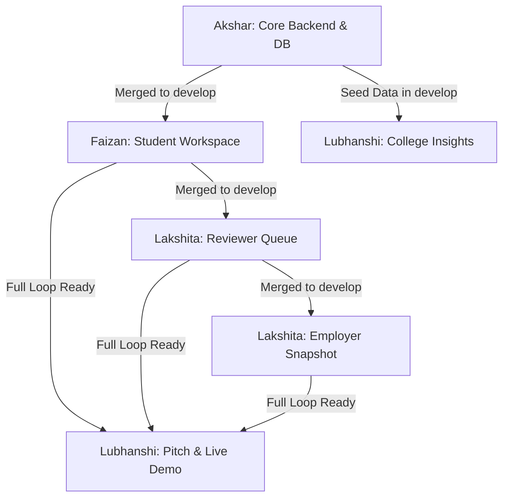

# ProofBridge — Akshar Miyani (Team Leader & Backend Architect)
## Master Antigravity AI Modular Playbook (Evaluation 1 → 2 → 3)

**Role:** Team Leader, Backend Architect, Supabase DBA, Integration Gatekeeper  
**Git Branches:** `develop` (Integration Core), `main` (Production / Jury Demo)  
**Assigned Directory Ownership:**  
- `supabase/migrations/**`, `supabase/seed.sql`, `scripts/**`
- `src/lib/server/**`, `src/lib/matching.ts`, `src/app/api/v1/**`
- `src/contracts/**`, `src/components/ui/AppShell.tsx`, `src/app/globals.css`, `src/app/page.tsx`

---

## 🛑 CROSS-MEMBER DEPENDENCY & BLOCKING RULES

Before running any merge or building downstream APIs, you MUST verify this dependency graph:



### ⚠️ BLOCKING CHECKS:
1. **Never merge a member's branch directly into `main`:** Always merge into `develop`, verify `npm run build`, and only fast-forward `main` when an evaluation milestone is reached.
2. **If Lakshita is waiting for Faizan's submission structure:** Faizan's `feat/student-experience` is ALREADY merged into `develop`. Lakshita can safely build on top of it.
3. **If Lubhanshi reports missing cohort data:** Ensure `supabase/seed.sql` has been applied to Supabase so `/api/v1/institution/cohort-summary` returns live records.
4. **If any member breaks the build:** Tell them: *"STOP: Run `npm run build` locally, fix all TypeScript/ESLint errors on your branch, and re-push before I can merge."*

---

# 📅 EVALUATION 1: MENTORING ROUND 1 (DAY 1: 17:30 – 21:00)
**Goal:** Prove live Supabase database connection, deterministic matching API ($61\% \rightarrow 96\%$), merged Student Experience, and prepare Reviewer Queue integration.

---

### 🔹 Prompt 1.1: Verify Live Supabase Connection & API Health
```text
You are pair programming with Akshar Miyani (Team Lead).
Task:
1. Verify our environment variables in .env.local and check that our Supabase pooler connection is operational.
2. Test the health check endpoint at /api/v1/health.
3. Call /api/v1/opportunities/40000000-0000-0000-0000-000000000001/match?include_sql_review=false. Confirm it returns reviewedCoverage = 61.
4. Call /api/v1/opportunities/40000000-0000-0000-0000-000000000001/match?include_sql_review=true. Confirm it returns reviewedCoverage = 96.
5. Report the output values and ensure zero errors.
```

---

### 🔹 Prompt 1.2: Check Remote Git Status & Teammate Branch Availability
```text
You are pair programming with Akshar Miyani (Team Lead).
Task:
1. Run 'git fetch origin' to see which branches our team members have pushed.
2. Check the commit log of origin/develop vs origin/feat/evaluator-and-employer and origin/feat/institution-insights.
3. Report:
   - Is Lakshita's branch ready for review?
   - Is Lubhanshi's branch ready for review?
4. If either member has not pushed, output a clear message telling Akshar which member to ping.
```

---

### 🔹 Prompt 1.3: Safe Merge & Integration of Lakshita's Reviewer PR
```text
You are pair programming with Akshar Miyani (Team Lead).
Prerequisite: Lakshita has pushed 'origin/feat/evaluator-and-employer'.
Task:
1. Check out a fresh temporary review branch:
   git checkout -b review/lakshita origin/feat/evaluator-and-employer
2. Merge develop into review/lakshita:
   git merge develop
3. If conflicts occur in AppShell or package.json, resolve them preserving modern SaaS styling and all dependencies.
4. Run 'npm run typecheck' and 'npm run build'.
5. If build succeeds with code 0:
   git checkout develop
   git merge review/lakshita --no-ff -m "merge: integrate reviewer queue and rubric evaluation from Lakshita"
   git push origin develop
   git branch -D review/lakshita
6. If build fails, STOP and list exact file names and errors so Akshar can instruct Lakshita to fix them.
```

---

### 🔹 Prompt 1.4: Safe Merge & Integration of Lubhanshi's College Insights PR
```text
You are pair programming with Akshar Miyani (Team Lead).
Prerequisite: Lubhanshi has pushed 'origin/feat/institution-insights'.
Task:
1. Check out a fresh temporary review branch:
   git checkout -b review/lubhanshi origin/feat/institution-insights
2. Merge develop into review/lubhanshi:
   git merge develop
3. Run 'npm run typecheck' and 'npm run build'.
4. If build succeeds with code 0:
   git checkout develop
   git merge review/lubhanshi --no-ff -m "merge: integrate college insights dashboard from Lubhanshi"
   git push origin develop
   git branch -D review/lubhanshi
5. Fast-forward main to develop:
   git checkout main && git merge develop --ff-only && git push origin main && git checkout develop
```

---

### 🔹 Prompt 1.5: UI Sanity & Navigation Check for Mentoring Evaluation
```text
You are pair programming with Akshar Miyani (Team Lead).
Evaluation 1 is starting.
Task:
1. Start local development server with 'npm run dev' on port 3000.
2. Verify all 4 primary navigation routes load with HTTP 200:
   - / (Landing Page with 6-Step Evidence Loop)
   - /student (Meera Patel Student Dashboard with 61% baseline)
   - /reviewer/queue (Dr. Alok Sharma Reviewer Queue)
   - /employer/opportunities (Sample Analytics Recruiter Hub)
   - /institution/insights (College Dean Analytics)
3. Ensure AppShell active persona badge, glassmorphism header, and modern SaaS typography render cleanly.
4. Confirm ready for Mentoring Round 1.
```

---

# 📅 EVALUATION 2: MIDNIGHT CHECKPOINT (DAY 1: 21:00 – DAY 2: 03:00)
**Goal:** Connect the live Atomic Review Publication API, test the complete cross-role data flow in PostgreSQL, and handle edge cases.

---

### 🔹 Prompt 2.1: Wire Atomic Review Publication Route (`/api/v1/reviews/publish`)
```text
You are pair programming with Akshar Miyani (Team Lead).
Task:
1. Create or update API route 'src/app/api/v1/reviews/publish/route.ts'.
2. The POST endpoint must accept:
   - submission_id (UUID)
   - reviewer_id (UUID)
   - rubric_scores (array of criterion_id, score 1-4, rationale)
   - overall_level (1-4)
   - qualitative_feedback (text)
3. Execute the atomic PostgreSQL transaction using our Supabase client:
   - Insert into 'evaluation_reviews'
   - Insert into 'evaluation_review_scores'
   - Call the atomic database function 'publish_review()' or update 'skill_attainments'
   - Write to 'outbox_events' for audit logging
4. Return the updated student match coverage immediately in the response.
5. Verify route types with 'npm run typecheck'.
```

---

### 🔹 Prompt 2.2: Verify Golden Loop End-to-End State Transition
```text
You are pair programming with Akshar Miyani (Team Lead).
Task:
1. Test the complete live loop against Supabase:
   - Step A: Verify Meera Patel has 3 baseline attainments (Spreadsheets L3, Comm L3, Reasoning L3) -> Match = 61%.
   - Step B: Trigger review publication for SQL challenge -> Attainment issued for SQL L3.
   - Step C: Call /api/v1/opportunities/40000000-0000-0000-0000-000000000001/match. Confirm match leaps to 96%.
   - Step D: Verify 'applications' table creates a frozen evidence snapshot grant.
2. Confirm zero database constraint violations and 100% mathematical accuracy.
```

---

### 🔹 Prompt 2.3: Build Demo State Reset Script (`scripts/reset-demo-state.mjs`)
```text
You are pair programming with Akshar Miyani (Team Lead).
Task:
1. Create a script 'scripts/reset-demo-state.mjs' using our pg database pooler.
2. The script must atomically reset the demo data:
   - Delete any created reviews for Meera's SQL challenge submission.
   - Reset Meera's SQL attainment so her reviewed coverage returns to 61%.
   - Reset submission status to 'SUBMITTED' (pending review by Dr. Alok Sharma).
   - Reset employer application status to 'PENDING_REVIEW'.
3. Add an npm script in package.json: "demo:reset": "node scripts/reset-demo-state.mjs".
4. Run the script and confirm the database resets in under 2 seconds.
```

---

# 📅 EVALUATION 3: FINAL JURY EVALUATION (DAY 2: 08:00 – 14:00)
**Goal:** Lock production build on `main`, rehearse the 5-minute live pitch, and prepare technical architecture defense.

---

### 🔹 Prompt 3.1: Production Lockdown & Zero-Error Audit
```text
You are pair programming with Akshar Miyani (Team Lead).
Task:
1. Ensure develop is fully merged into main:
   git checkout main
   git merge develop --ff-only
   git push origin main
2. Run 'npm run typecheck' and 'npm run build'. Confirm 0 warnings and 0 errors.
3. Check browser console logs across all routes to ensure no unhandled hydration warnings or React key errors.
4. Run 'npm run demo:reset' so Meera is in the clean 61% baseline state before judges arrive.
```

---

### 🔹 Prompt 3.2: Technical Architecture Defense Preparation
```text
You are pair programming with Akshar Miyani (Team Lead).
Task:
Review and format our Lead Architect Jury Defense Responses:
1. Why not use an LLM to score student submissions?
   - Answer: LLMs are non-deterministic, prone to prompt injections, hallucinate grades, and fail employment legal defensibility. ProofBridge uses deterministic math (coverage-v1) and human-anchored rubrics for legally sound employment proof.
2. How does ProofBridge scale without overwhelming faculty?
   - Answer: Scoped 2-hour bounded challenges, reusable 4-level anchored rubrics taking <5 minutes per review, and university accreditation / workload points for faculty reviews.
3. How is tamper resistance guaranteed?
   - Answer: Once a review is published, the attainment revision is cryptographically frozen into a immutable snapshot linked to the employer application.
Print this defense sheet in clear bullet points for Akshar to keep open during jury questions.
```
