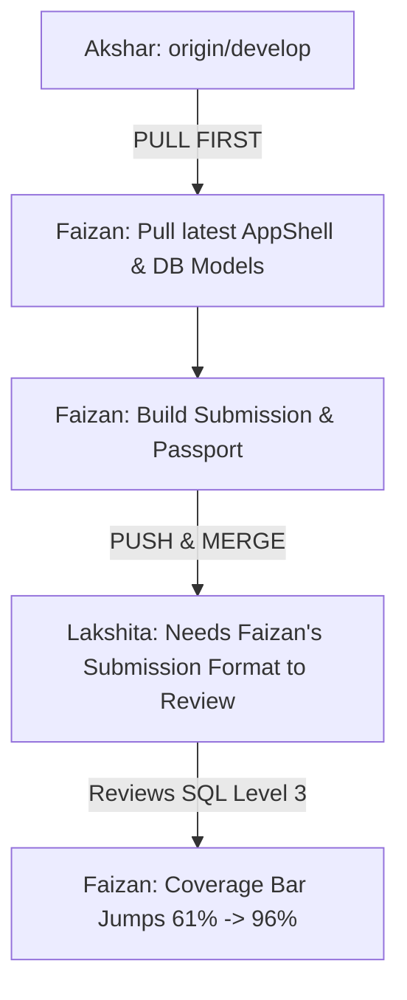

# ProofBridge — Faizan (Student Experience Engineer)
## Master Antigravity AI Modular Playbook (Evaluation 1 → 2 → 3)

**Role:** Student Experience Engineer & Frontend UI Specialist  
**Git Branch:** `feat/student-experience`  
**Assigned Directory Ownership:**  
- `src/app/student/**`, `src/app/challenges/**`
- `src/components/student/**` (`CoverageBar.tsx`, `EvidenceDrawer.tsx`, `StatusChip.tsx`, `StudentNav.tsx`, etc.)

---

## 🛑 CROSS-MEMBER DEPENDENCY & BLOCKING RULES

Before writing code or opening PRs, verify your dependencies with teammates:



### ⚠️ BLOCKING CHECKS:
1. **Always pull `origin/develop` before editing:** Akshar regularly updates core styling and API routes. If you do not pull first, you risk overwriting backend contracts.
2. **Do NOT touch files in `supabase/` or `src/app/reviewer/` or `src/app/employer/`:** Lakshita and Akshar own those directories.
3. **If Lakshita is waiting for submission data:** Your challenge page `/challenges/[id]` provides the payload (SQL query, Contribution Statement, AI disclosure) that Dr. Sharma evaluates. Keep this payload contract consistent.
4. **Before pushing to GitHub:** You MUST run `npm run build` locally. Never push code that breaks compilation!

---

# 📅 EVALUATION 1: MENTORING ROUND 1 (DAY 1: 17:30 – 21:00)
**Goal:** Deliver a visually stunning Student Dashboard, Evidence Passport, Evidence Drawer, and SQL Challenge Workspace with modern SaaS styling.

---

### 🔹 Prompt 1.1: Pull Latest `develop` & Environment Sanity Check
```text
You are pair programming with Faizan (Student Experience Engineer).
Task:
1. Fetch latest changes from remote and merge develop into our feature branch:
   git checkout develop
   git pull origin develop
   git checkout feat/student-experience
   git merge develop
2. Confirm that our branch has Akshar's updated AppShell and global styling.
3. Run 'npm run build' to verify our base is healthy.
```

---

### 🔹 Prompt 1.2: Upgrade Student Dashboard Styling (No Plain / Ugly UI)
```text
You are pair programming with Faizan.
Task:
1. Open 'src/app/student/page.tsx'.
2. Upgrade the UI to modern high-end SaaS standards:
   - Ensure all cards use 'bg-white rounded-2xl border border-slate-200/80 shadow-xs hover:shadow-md transition-all'.
   - The 'Next Step' hero banner must use a rich dark gradient: 'bg-gradient-to-br from-slate-900 via-slate-800 to-indigo-950 text-white rounded-2xl p-6 sm:p-8 shadow-lg relative overflow-hidden'.
   - Color-code the status chips:
     * Reviewed Level 3: emerald pill (bg-emerald-50 text-emerald-700 border-emerald-200)
     * Gap / Missing: amber pill (bg-amber-50 text-amber-700 border-amber-200)
   - Style the 'coverage-v1' accordion breakdown with clean monospace formulas and clear tabular weights.
3. Verify with 'npm run build'.
```

---

### 🔹 Prompt 1.3: Polish Evidence Drawer (`src/components/student/EvidenceDrawer.tsx`)
```text
You are pair programming with Faizan.
Task:
1. Open 'src/components/student/EvidenceDrawer.tsx'.
2. Enhance the slide-over drawer animation with a smooth backdrop blur:
   - Container: 'fixed inset-y-0 right-0 max-w-xl w-full bg-white shadow-2xl border-l border-slate-200 z-50 overflow-y-auto p-6 space-y-6 animate-in slide-in-from-right duration-300'.
   - Reviewer Badge: Display 'Verified by Dr. Alok Sharma (Associate Professor & Analytics Mentor)' with a verified checkmark icon.
   - Criteria Breakdown: Display 4 clean rubric cards showing criteria ratings (Level 1 to 4) with faculty rationale quotes.
   - External Proof Links: GitHub repository and Google Sheet links styled as clickable pill buttons opening in a new tab.
3. Verify that clicking an attainment on the Evidence Passport page opens this drawer smoothly.
```

---

### 🔹 Prompt 1.4: Refactor Challenge Workspace with Dark IDE Code Theme (`/challenges/[id]`)
```text
You are pair programming with Faizan.
Task:
1. Open 'src/app/challenges/[id]/page.tsx'.
2. Elevate the Challenge Workspace UI:
   - Code Editor: Style the SQL solution editor inside a dark IDE box ('bg-slate-900 text-emerald-400 font-mono text-xs rounded-xl p-5 border border-slate-800 shadow-inner').
   - Contribution Statement: Provide an expansive text box with an informative callout:
     'Explain what you built yourself, what edge cases you resolved, and any AI assistance utilized.'
   - AI Disclosure Toggle: Clean toggle pills: 'Used ChatGPT for SQL syntax verification', 'No AI used', 'Custom prompts'.
   - Finalize Submission Modal: Clicking 'Finalize Submission' opens a crisp confirmation dialog prompting the student to verify their statements before signing off.
3. Test locally using 'npm run build'.
```

---

### 🔹 Prompt 1.5: Build Verification & Push to Remote
```text
You are pair programming with Faizan.
Task:
1. Run 'npm run typecheck'.
2. Run 'npm run build'. Confirm 0 warnings and 0 errors.
3. Commit and push:
   git add .
   git commit -m "style(student): upgrade dashboard, evidence drawer, and challenge workspace with modern SaaS polish"
   git push origin feat/student-experience
4. Notify Akshar that 'feat/student-experience' is ready for review.
```

---

# 📅 EVALUATION 2: MIDNIGHT CHECKPOINT (DAY 1: 21:00 – DAY 2: 03:00)
**Goal:** Connect live submission action to the database, test the empty student account simulation, and handle submission state transitions.

---

### 🔹 Prompt 2.1: Wire Finalize Submission Button to API
```text
You are pair programming with Faizan.
Prerequisite: Akshar has merged the submission route into develop.
Task:
1. Pull develop:
   git checkout develop && git pull origin develop
   git checkout feat/student-experience && git merge develop
2. In 'src/app/challenges/[id]/page.tsx':
   - In the submission confirmation handler, call POST '/api/v1/submissions'.
   - Send payload: { challenge_id, student_id: '00000000-0000-0000-0000-000000000001', submission_body, contribution_statement, ai_disclosure_notes, external_links }.
   - If response is successful, show a sleek success card:
     'Submission Received! Assigned to Dr. Alok Sharma for Rubric Review.'
   - Redirect to '/student' after 2 seconds with submission status chip showing 'Awaiting Faculty Review'.
3. Verify build with 'npm run build'.
```

---

### 🔹 Prompt 2.2: Test Empty Student Account Simulation Toggle
```text
You are pair programming with Faizan.
Task:
1. In 'src/app/student/page.tsx', verify the 'Simulate Empty/New Student Account' toggle button.
2. In 'Empty State' mode:
   - Show a modern onboarding card: 'Add Your First Verifiable Evidence'.
   - Explain how ProofBridge replaces resume claims with authentic proof.
   - Provide a primary CTA button: 'Start Beginner Challenge: Explain Monthly Sales →' linking to /challenges/50000000-0000-0000-0000-000000000001.
3. In 'Seeded Account' mode:
   - Restore Meera Patel's baseline: 61% reviewed coverage, 3 verified attainments.
4. Ensure switching between the two modes is instantaneous without page reload.
```

---

# 📅 EVALUATION 3: FINAL JURY EVALUATION (DAY 2: 08:00 – 14:00)
**Goal:** Animate the $61\% \rightarrow 96\%$ coverage score leap, audit responsive mobile views, and rehearse the student demo.

---

### 🔹 Prompt 3.1: Animate the $61\% \rightarrow 96\%$ Coverage Leap
```text
You are pair programming with Faizan.
Task:
1. In 'src/components/student/CoverageBar.tsx':
   - Ensure the progress fill uses smooth CSS animations: 'transition-all duration-700 ease-out'.
   - Add visual flair when coverage hits >= 90%: change progress bar color from electric blue (bg-blue-600) to vibrant emerald (bg-emerald-500) with a subtle glowing aura.
   - Display a badge: '✓ Qualified for Direct Interview Shortlist' when coverage >= 90%.
2. Verify in browser that the transition looks impressive for judges.
```

---

### 🔹 Prompt 3.2: Mobile Responsiveness & Final Polish
```text
You are pair programming with Faizan.
Task:
1. Audit all student screens on mobile viewport (375px width) and tablet viewport (768px):
   - Fix any horizontal scrolling or text overflows.
   - Ensure 'StudentNav.tsx' mobile bar displays clear icons and active states.
2. Run 'npm run build' to confirm 100% clean production build.
3. Push final polish:
   git push origin feat/student-experience
4. Notify Akshar that the Student Experience is locked for final judging.
```
