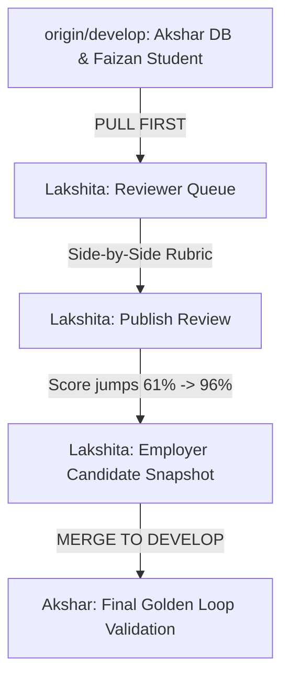

# ProofBridge — Lakshita (Evaluator & Employer Workspaces Engineer)
## Master Antigravity AI Modular Playbook (Evaluation 1 → 2 → 3)

**Role:** Evaluator & Employer Experience Specialist  
**Git Branch:** `feat/evaluator-and-employer`  
**Assigned Directory Ownership:**  
- `src/app/reviewer/**`, `src/app/employer/**`
- `src/components/reviewer/**`, `src/components/employer/**`

---

## 🛑 CROSS-MEMBER DEPENDENCY & BLOCKING RULES

Before writing code, verify your dependencies:



### ⚠️ BLOCKING CHECKS:
1. **STOP & PULL FIRST:** Before doing any work, run `git checkout develop && git pull origin develop && git checkout feat/evaluator-and-employer && git merge develop`.
2. **Do NOT touch files in `supabase/` or `src/app/student/`:** Akshar and Faizan own those directories.
3. **If Faizan changes submission format:** Verify that the submission details in `/reviewer/evaluations/[id]` match what Faizan built in `/challenges/[id]`.
4. **Before pushing to GitHub:** Run `npm run build`. If it fails, STOP and fix the errors on your branch before notifying Akshar!

---

# 📅 EVALUATION 1: MENTORING ROUND 1 (DAY 1: 17:30 – 21:00)
**Goal:** Deliver the Faculty Review Queue (`/reviewer/queue`) and the Side-by-Side Rubric Evaluation Workspace (`/reviewer/evaluations/[id]`) with working 4-level rubric selector.

---

### 🔹 Prompt 1.1: Pull Latest `develop` & Setup Feature Branch
```text
You are pair programming with Lakshita (Evaluator & Employer Specialist).
Task:
1. Pull develop into our feature branch:
   git checkout develop
   git pull origin develop
   git checkout feat/evaluator-and-employer
   git merge develop
2. Confirm that AppShell, Tailwind tokens, and shared packages are ready.
3. Run 'npm run build' to confirm a clean starting state.
```

---

### 🔹 Prompt 1.2: Build Faculty Review Queue (`src/app/reviewer/queue/page.tsx`)
```text
You are pair programming with Lakshita.
Task:
1. Create or update 'src/app/reviewer/queue/page.tsx'.
2. Wrap inside <AppShell>.
3. Header Section:
   - Title: 'Faculty Review Queue • Dr. Alok Sharma'
   - Subtitle: 'Department of Computer Science • Demo College of Computing'
   - Stat Pills: '1 Pending Review', '14 Reviews Published this Semester', 'Avg Turnaround: 18 hours'.
4. Queue Table / Cards:
   - Display pending submission card:
     * Student: Meera Patel (MCA 2026)
     * Challenge: 'Explain Monthly Sales from Messy Dataset'
     * Target Skill: SQL (Structured Query Language) — Required Level 3
     * Submitted: 2 hours ago
     * Urgency Pill: 'Needs Review (< 24h SLA)' (Amber badge)
     * Primary CTA: 'Evaluate Submission →' linking to '/reviewer/evaluations/sub-sql-001'.
5. UI standards: use 'bg-white rounded-2xl border border-slate-200/80 shadow-xs hover:shadow-md transition-all'.
6. Verify build with 'npm run build'.
```

---

### 🔹 Prompt 1.3: Build Side-by-Side Rubric Evaluation Workspace (`src/app/reviewer/evaluations/[id]/page.tsx`)
```text
You are pair programming with Lakshita.
Task:
1. Create or update 'src/app/reviewer/evaluations/[id]/page.tsx'.
2. Wrap inside <AppShell>.
3. Implement a responsive 2-column split-screen layout:
   - LEFT COLUMN (Student Artifact Viewer):
     * Student: Meera Patel • Challenge: Monthly Sales Breakdown
     * Code Box: PostgreSQL query with syntax formatting in dark IDE container (bg-slate-900 text-emerald-400 font-mono text-xs rounded-xl p-5 border border-slate-800).
     * Contribution Statement Box: Meera's statement on cleaning 14 missing date fields and independently writing joins.
     * AI Disclosure Tag: 'ChatGPT used for syntax verification only' (Amber pill).
   - RIGHT COLUMN (Anchored 4-Level Rubric):
     * Rubric Title: 'SQL Optimization & Business Aggregation (coverage-v1)'
     * 4 Selectable Level Cards:
       Level 1 (Novice): Basic SELECT, syntax errors or missing WHERE filters.
       Level 2 (Developing): Working queries without window functions or aggregations.
       Level 3 (Proficient): Proper window functions (LAG), clean NULLIF handling, verified totals.
       Level 4 (Advanced): Complex execution plans, indexing strategies, sub-second latency.
     * State: Clicking Level 3 highlights card with 'ring-2 ring-emerald-500 bg-emerald-50/50 border-emerald-400'.
     * Reviewer Comments: Textarea with prefilled mentor note:
       'Excellent implementation of window functions and NULLIF division guard. Solid design decisions explained in contribution statement.'
     * Primary CTA: 'Publish Attainment (Level 3)' with confirmation modal.
4. Verify with 'npm run build'.
```

---

### 🔹 Prompt 1.4: Verify & Push Evaluation 1 Deliverables
```text
You are pair programming with Lakshita.
Task:
1. Run 'npm run typecheck'.
2. Run 'npm run build'. Confirm 0 errors.
3. Commit and push:
   git add src/app/reviewer
   git commit -m "feat(reviewer): implement faculty review queue and side-by-side anchored rubric evaluation"
   git push origin feat/evaluator-and-employer
4. Notify Akshar that the Reviewer Queue is ready for merge.
```

---

# 📅 EVALUATION 2: MIDNIGHT CHECKPOINT (DAY 1: 21:00 – DAY 2: 03:00)
**Goal:** Build the Employer Hub (`/employer/opportunities`) and the Candidate Evidence Snapshot Viewer (`/employer/candidates/[id]`).

---

### 🔹 Prompt 2.1: Build Employer Hub (`src/app/employer/opportunities/page.tsx`)
```text
You are pair programming with Lakshita.
Task:
1. Pull latest develop:
   git checkout develop && git pull origin develop
   git checkout feat/evaluator-and-employer && git merge develop
2. Create or update 'src/app/employer/opportunities/page.tsx' wrapped in <AppShell>.
3. Header:
   - 'Employer Hub • Sample Analytics Studio'
   - Status badge: 'Verified Industry Partner' (Emerald pill)
4. Opportunity Card:
   - Role: 'Junior Data Analyst Intern' (Jaipur / Hybrid • ₹25,000/mo)
   - Weighted Skill Requirements:
     * SQL: 35% (Req Level 3)
     * Spreadsheets: 25% (Req Level 3)
     * Analytical Reasoning: 24% (Req Level 3)
     * Written Communication: 16% (Req Level 4)
   - Applicant Ticker: '1 Applicant Ready for Screening'
   - Button: 'Inspect Qualified Candidates (1) →' linking to '/employer/candidates/cand-meera-001'.
5. Verify build with 'npm run build'.
```

---

### 🔹 Prompt 2.2: Build Candidate Evidence Snapshot Viewer (`src/app/employer/candidates/[id]/page.tsx`)
```text
You are pair programming with Lakshita.
Task:
1. Create or update 'src/app/employer/candidates/[id]/page.tsx' wrapped in <AppShell>.
2. Header:
   - Candidate: Meera Patel (MCA 2026 • Demo College of Computing)
   - Freeze Badge: '🔒 Tamper-Resistant Proof Snapshot — Frozen at Application Time' (slate-900 pill with white text).
   - Match Metric: Large bold 96% reviewed coverage with breakdown.
3. Evidence Breakdown:
   - SQL Level 3: Verified by Dr. Alok Sharma on Sep 08, 2026. Quote: 'Demonstrated clean LAG window functions and defensive NULLIF.'
   - Spreadsheets Level 3: Verified by Dr. Alok Sharma.
   - Analytical Reasoning Level 3: Verified by Dr. Alok Sharma.
   - Written Communication Level 3: Verified by Prof. Ananya Sen.
4. Action CTA:
   - 'Shortlist for Technical Interview' (Primary Green button with confirmation modal).
   - 'Download Full Audit Verification PDF' (Secondary button).
5. Verify build with 'npm run build' and push to origin feat/evaluator-and-employer.
```

---

# 📅 EVALUATION 3: FINAL JURY EVALUATION (DAY 2: 08:00 – 14:00)
**Goal:** Polish all evaluator and recruiter workflows, eliminate all visual rough edges, and rehearse the live evaluation demo.

---

### 🔹 Prompt 3.1: Reviewer-to-Employer State Confirmation Modal
```text
You are pair programming with Lakshita.
Task:
1. In 'src/app/reviewer/evaluations/[id]/page.tsx':
   - When Dr. Sharma clicks 'Publish Attainment (Level 3)', display a rich animated modal:
     'Attainment Published Successfully! Meera Patel has attained SQL Level 3. Coverage for Junior Data Analyst Intern updated to 96%. Recruiter snapshot refreshed.'
   - Provide a direct link: 'View in Employer Hub →' so judges can immediately see the result!
2. Run 'npm run build' and push to origin feat/evaluator-and-employer.
```

---

### 🔹 Prompt 3.2: Final Visual Polish & Jury Readiness
```text
You are pair programming with Lakshita.
Task:
1. Audit reviewer and employer screens on multiple screen sizes.
2. Ensure all text contrast ratios meet WCAG AA standards.
3. Verify that all buttons provide visible hover and active states.
4. Notify Akshar that the Reviewer & Employer workspace is locked and ready for the final pitch.
```
