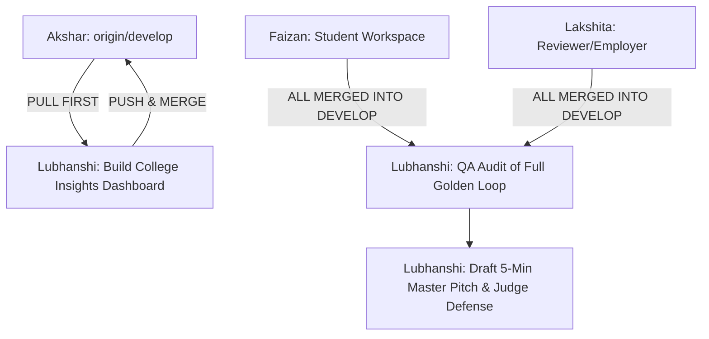

# ProofBridge — Lubhanshi (Institution Insights, QA & Pitch Lead)
## Master Antigravity AI Modular Playbook (Evaluation 1 → 2 → 3)

**Role:** Institution Insights Engineer, QA Lead & Pitch Architect  
**Git Branch:** `feat/institution-insights`  
**Assigned Directory Ownership:**  
- `src/app/institution/**`, `src/components/institution/**`
- `docs/DEMO_SCRIPT_GOLDEN_LOOP.md`, `docs/PITCH_DECK_OUTLINE.md`, `docs/JUDGE_DEFENSE_FAQ.md`

---

## 🛑 CROSS-MEMBER DEPENDENCY & BLOCKING RULES

Before writing code or drafting presentation materials, verify your dependencies:



### ⚠️ BLOCKING CHECKS:
1. **STOP & PULL FIRST:** Always start by pulling `origin/develop` so you have the latest `AppShell` and backend models.
2. **Do NOT touch files in `src/app/student/` or `src/app/reviewer/`:** Focus on your analytics pages and documentation.
3. **If testing the live demo:** You CANNOT rehearse the full Golden Loop until Faizan's student submission and Lakshita's reviewer queue are merged into `develop`. Check `git log origin/develop` to confirm their commits are present.
4. **Before pushing to GitHub:** Run `npm run build` locally. Never push code that breaks compilation!

---

# 📅 EVALUATION 1: MENTORING ROUND 1 (DAY 1: 17:30 – 21:00)
**Goal:** Deliver the College Insights Dashboard (`/institution/insights`) with cohort analytics, gap heatmaps, and automated curriculum intervention cards.

---

### 🔹 Prompt 1.1: Pull Latest `develop` & Setup Feature Branch
```text
You are pair programming with Lubhanshi (Institution Insights & Pitch Lead).
Task:
1. Pull develop into our feature branch:
   git checkout develop
   git pull origin develop
   git checkout feat/institution-insights
   git merge develop
2. Confirm that AppShell and design tokens are ready.
3. Run 'npm run build' to confirm a clean base.
```

---

### 🔹 Prompt 1.2: Build Top KPI Stat Grid (`src/app/institution/insights/page.tsx`)
```text
You are pair programming with Lubhanshi.
Task:
1. Create or update 'src/app/institution/insights/page.tsx'.
2. Wrap inside <AppShell>.
3. Header Section:
   - Title: 'Institutional Intelligence & Curriculum Insights'
   - Subtitle: 'Demo College of Computing • MCA Cohort 2026 (120 Enrolled Students)'
   - Badge: 'Accreditation Ready • NAAC / NBA Aligned' (Emerald pill)
4. KPI Metric Grid (4 Stat Cards):
   - Card 1: '120' Enrolled Students ('94 Active on ProofBridge')
   - Card 2: '342' Human-Verified Attainments ('+28 this week')
   - Card 3: '64%' Average Placement Readiness ('Based on 14 Target Employer Roles')
   - Card 4: 'SQL' Critical Deficit Alert ('42% of students below Level 3 benchmark' in amber/red alert pill)
5. Use modern styling: 'bg-white rounded-2xl border border-slate-200/80 p-6 shadow-xs'.
6. Verify with 'npm run build'.
```

---

### 🔹 Prompt 1.3: Build Cohort Gap Breakdown Table & Curriculum Action Card
```text
You are pair programming with Lubhanshi.
Task:
1. In 'src/app/institution/insights/page.tsx', add the Cohort Skill Gap Breakdown section:
   - Title: 'Industry Benchmark vs Cohort Attainment Level'
   - Table showing:
     * Skill: SQL (Structured Query Language) | Industry Target: Level 3 | Cohort Avg: Level 1.8 | Deficit: -42% | Status: High Risk Deficit (Amber Pill)
     * Skill: Spreadsheets & Auditing | Industry Target: Level 3 | Cohort Avg: Level 2.9 | Deficit: -4% | Status: Aligned (Emerald Pill)
     * Skill: Written Technical Comm | Industry Target: Level 4 | Cohort Avg: Level 3.1 | Deficit: -18% | Status: Moderate Deficit (Blue Pill)
     * Skill: Analytical Reasoning | Industry Target: Level 3 | Cohort Avg: Level 3.0 | Deficit: 0% | Status: Aligned (Emerald Pill)
2. Add the Actionable Intervention Card below the table:
   - Header: '⚡ Automated Academic Intervention Recommendation'
   - Description: '42 MCA students currently lack Level 3 SQL proficiency required by 8 active campus hiring opportunities. Scheduling an intensive 2-day SQL Bootcamp will unlock eligibility for an estimated 38 student placements.'
   - Button: 'Schedule 2-Day SQL Bootcamp' with an interactive confirmation toggle:
     '✓ Workshop Scheduled: Sep 14–15, 2026. Automated notification dispatched to 42 students.'
3. Test locally with 'npm run build'.
```

---

### 🔹 Prompt 1.4: Verify & Push Evaluation 1 Deliverables
```text
You are pair programming with Lubhanshi.
Task:
1. Run 'npm run typecheck'.
2. Run 'npm run build'. Confirm 0 warnings and 0 errors.
3. Commit and push:
   git add src/app/institution
   git commit -m "feat(institution): implement college insights dashboard with cohort skill deficits and curriculum interventions"
   git push origin feat/institution-insights
4. Notify Akshar that 'feat/institution-insights' is ready for merge.
```

---

# 📅 EVALUATION 2: MIDNIGHT CHECKPOINT (DAY 1: 21:00 – DAY 2: 03:00)
**Goal:** Conduct the End-to-End QA Route Audit across all 4 personas and author the Master Demo Script and Pitch Deck outline.

---

### 🔹 Prompt 2.1: End-to-End QA Route Audit
```text
You are pair programming with Lubhanshi (QA Lead).
Prerequisite: Akshar has merged student, reviewer, employer, and institution branches into develop.
Task:
1. Pull develop:
   git checkout develop && git pull origin develop
   git checkout feat/institution-insights && git merge develop
2. Run a full build: 'npm run build'.
3. Audit all routes:
   - '/' (Landing Page)
   - '/student' (Student Dashboard)
   - '/student/passport' (Evidence Passport)
   - '/challenges/50000000-0000-0000-0000-000000000001' (SQL Challenge)
   - '/opportunities/40000000-0000-0000-0000-000000000001' (Opportunity Match)
   - '/reviewer/queue' (Reviewer Queue)
   - '/reviewer/evaluations/sub-sql-001' (Rubric Evaluation)
   - '/employer/opportunities' (Employer Hub)
   - '/employer/candidates/cand-meera-001' (Candidate Proof Viewer)
   - '/institution/insights' (College Insights)
4. Confirm all buttons link to valid routes with zero 404s. Report results.
```

---

### 🔹 Prompt 2.2: Create Master Demo Script (`docs/DEMO_SCRIPT_GOLDEN_LOOP.md`)
```text
You are pair programming with Lubhanshi (Pitch Architect).
Task:
1. Create 'docs/DEMO_SCRIPT_GOLDEN_LOOP.md' outlining the live 180-second walkthrough for the jury:
   - 0:00 - 0:30: The Problem (Resume claims are unverifiable; AI keyword screening rejects top talent).
   - 0:30 - 1:00: Student View (Meera Patel at 61% reviewed coverage, missing SQL = 35 points).
   - 1:00 - 1:30: Bounded Challenge (Meera submits SQL query + human contribution statement).
   - 1:30 - 2:00: Faculty Reviewer (Dr. Sharma opens side-by-side rubric, verifies Level 3, publishes review).
   - 2:00 - 2:20: Instant Score Leap (Meera's coverage leaps from 61% to 96% in real-time).
   - 2:20 - 2:40: Recruiter Shortlist (Sample Analytics Studio inspects frozen proof snapshot, not a resume).
   - 2:40 - 3:00: College Dean Insights (Identifies cohort deficit, schedules curriculum intervention).
2. Commit and push to origin feat/institution-insights.
```

---

### 🔹 Prompt 2.3: Create 10-Slide Pitch Deck Narrative (`docs/PITCH_DECK_OUTLINE.md`)
```text
You are pair programming with Lubhanshi.
Task:
1. Create 'docs/PITCH_DECK_OUTLINE.md' with complete slide-by-slide structure and speaker scripts:
   - Slide 1: Hook & Problem (The $4.2B Resume Fraud & Mismatched Hiring Problem).
   - Slide 2: The Solution (ProofBridge: Evidence-Based Opportunity Protocol).
   - Slide 3: The Secret Sauce (Deterministic matching: coverage-v1 + Human Rubric Attribution).
   - Slide 4: Live Architecture & Golden Loop (6 closed-loop steps).
   - Slide 5: Student Experience (Proof passport vs resume).
   - Slide 6: Faculty Reviewer Engine (Anchored rubrics & workload credits).
   - Slide 7: Employer Advantage (Zero candidate re-testing, frozen proof snapshots).
   - Slide 8: College Intelligence (Curriculum gap analytics).
   - Slide 9: Market Size & Business Model (B2B SaaS for Colleges & Hiring Fee for Employers).
   - Slide 10: Team & Roadmap.
2. Commit and push to origin feat/institution-insights.
```

---

# 📅 EVALUATION 3: FINAL JURY EVALUATION (DAY 2: 08:00 – 14:00)
**Goal:** Deliver the Judge Defense FAQ, rehearse time cues, and lead the team to victory in the final jury room.

---

### 🔹 Prompt 3.1: Create Judge Defense FAQ (`docs/JUDGE_DEFENSE_FAQ.md`)
```text
You are pair programming with Lubhanshi.
Task:
1. Create 'docs/JUDGE_DEFENSE_FAQ.md' containing bulletproof responses to the 5 toughest jury questions:
   - Q1: How do you prevent students from using ChatGPT to write submissions?
     * Defense: Mandatory Contribution Statements explaining architectural tradeoffs, specific faculty rubric criteria testing edge cases, and random oral review checks.
   - Q2: Why would busy college professors spend time grading extra submissions?
     * Defense: Integrated into existing course assignments and lab evaluations; reviews count toward university accreditation (NBA/NAAC Criterion 2 & 3) and faculty service hours.
   - Q3: Why not use an automated LLM grader?
     * Defense: LLM grading cannot be audited or legally defended in hiring disputes. Named human attribution creates legal trust and academic accreditation.
   - Q4: What happens if an employer has unique skill requirements?
     * Defense: Employers customize proficiency levels (1-4) and weights (totaling 100%) dynamically; coverage-v1 adapts instantly.
   - Q5: How do you prevent colleges from inflating student grades?
     * Defense: Reviewers sign submissions with their professional identity; recruiter feedback loops create reputational accountability for institutions.
2. Commit and push to origin feat/institution-insights.
```

---

### 🔹 Prompt 3.2: Final Demo Rehearsal & Pitch Polish
```text
You are pair programming with Lubhanshi.
Task:
1. Review all demo routes and verify that clicking through the live scenario takes under 3 minutes.
2. Ensure pitch speaking roles are clearly divided:
   - Lubhanshi: Introduction, Problem statement, College insights, Business Model.
   - Faizan: Student Evidence Passport & Bounded Challenge walkthrough.
   - Lakshita: Faculty Rubric Review & Employer Candidate Snapshot walkthrough.
   - Akshar: Technical Architecture, Deterministic coverage-v1 math, Database integrity, and Judge technical Q&A.
3. Run 'npm run build' and push to origin feat/institution-insights.
```
